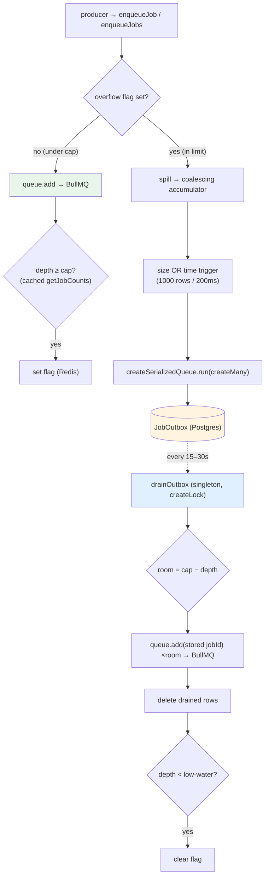

# Jobs Overflow Buffer — durable backpressure in front of BullMQ

> **Status:** Proposal for review · **Area:** Jobs / queue infrastructure · **Type:** Architecture decision + implementation plan
>
> A generic, durable overflow buffer that sits in front of BullMQ at the single `enqueueJob`
> chokepoint. When a fan-out would overwhelm Redis, jobs spill to a Postgres outbox table
> instead, and a singleton cron meters them back into the queue. Keeps per-recipient jobs
> (clean idempotent retries) without the Redis-memory blowup that drove the chunking debate.

---

## 1. Why

BullMQ keeps every waiting/delayed job in Redis. A large fan-out — one send producing tens of
thousands of per-recipient jobs — piles all of those into Redis at once. Past a point that's
out-of-memory territory, and a Redis OOM doesn't fail gracefully: jobs already queued get lost,
and the workers spend cycles thrashing. This is a real, lived failure mode at scale, not a
hypothetical.

The usual fix is **chunking** — make each job cover N recipients so there are fewer jobs. It
works, but it changes the unit of work: a chunk retry re-runs many recipients, so you need an
anti-join ledger to make retries safe, and you lose clean per-recipient idempotency and
observability.

We want the opposite trade: **keep one job per unit of work** (clean `jobId`-based idempotent
retries, per-job status) and instead **bound how many jobs sit in Redis at any instant** —
holding the overflow in cheap, durable Postgres until the queue has room.

BullMQ's built-in rate limiter doesn't solve this: it caps *processing* rate, but the waiting
jobs still occupy Redis memory. We need to bound *queue depth*, not throughput.

---

## 2. Decision

> **Add a durable overflow buffer at the `enqueueJob` chokepoint. Under normal load, jobs go
> straight to BullMQ. Once queue depth crosses a cap, an "overflow" flag flips and further
> enqueues spill to a Postgres `JobOutbox` table; a singleton drain cron meters them back into
> BullMQ as room frees up. Generic for all job types — instrumented once at the one chokepoint.**

This is the **transactional outbox + leaky-bucket drain** pattern. It's generic because every
job already routes through one function (`apps/api/src/jobs/enqueue.ts`), so the buffer is added
in one place and every job type gets it for free.

What this is **not**: chunking (rejected — see §7), a 1:1 thing, or email-specific. The email
send path is the first consumer, but this is queue infrastructure.

---

## 3. Architecture



Two states, one flag:

- **Normal:** flag clear → `queue.add` directly. Each add cheaply checks (cached) depth and trips
  the flag when it crosses the cap.
- **Overflow:** flag set → spill to the outbox via the batcher. The drain cron tops the queue back
  up to the cap each tick and clears the flag once depth drops below a low-water mark.

---

## 4. The overflow flag

A single Redis key (`${redisNamespace.job}:overflow`) is the shared state. The enqueue hot path
reads it on every call — one cheap `GET` (cache it for ~1s per process if even that shows up).

- **Set inline.** An enqueue that observes depth ≥ cap sets it. Setting inline (not only from the
  cron) is what closes the inter-tick hole: a fan-out can fill the queue in seconds, long before
  the next drain tick, so the producer side has to be able to trip it.
- **Cleared by the drain** at a low-water mark (e.g. 80% of cap), not exactly at the cap — so it
  doesn't flap clear→burst→set every tick.
- **Global**, so it coordinates the fleet: the first process to cross the cap sets it, and every
  other process sees it on their next enqueue.

Depth is read with BullMQ's `queue.getJobCounts('waiting', 'delayed')` — fleet-global state in one
cheap call, cached with a short TTL so it runs ~once/sec regardless of enqueue rate. **No worker
enumeration needed** (see §7).

---

## 5. The enqueue chokepoint

`enqueueJob` (and a batch sibling `enqueueJobs`) gains the flag check. In test mode it still
short-circuits to synchronous execution — the buffer is a no-op there.

```
enqueueJob(name, payload, opts):
  if isTest: run synchronously                      # unchanged
  if opts.bypass: return queue.add(...)             # latency-critical jobs skip the cap
  if overflowFlag:
     return spill(name, payload, opts)              # → batcher → outbox
  job = queue.add(...)
  if cachedDepth() ≥ MAX_QUEUE_DEPTH: setOverflowFlag()
  return job
```

- **`bypass`** on the options skips the cap and goes straight to BullMQ. Under sustained overflow
  *everything* spills, including a transactional welcome/verification, which then waits up to a
  drain tick. `bypass: true` keeps latency-critical, low-volume jobs direct. Bulk fan-outs are what
  fill the queue; letting a password-reset jump the buffer costs nothing.
- **Producers hand over lists.** A fan-out (the email Sender) calls `enqueueJobs(name, payloads[])`
  with its whole resolved list rather than looping — see §6.

---

## 6. Spill batching — coalescing write-behind

Spilling one `INSERT` per enqueue is slow under a fan-out. Instead, spills coalesce into bulk
`createMany` writes via an in-process accumulator with a **size-OR-time** trigger.

```
acc = []                                  # { row, resolve, reject }
flushQueue = createSerializedQueue()      # serialize the writes — one createMany at a time

spill(row) => new Promise((resolve, reject) => {
  acc.push({ row, resolve, reject })
  if (acc.length >= FLUSH_MAX_ROWS) flush()                 # size trip
  else if (!timer) timer = setTimeout(flush, FLUSH_LINGER)  # arm for the tail
})

flush() => {
  clearTimer()
  const batch = acc; acc = []             # synchronous swap — single-threaded JS, no await between
  flushQueue.run(async () => {
    try { await db.jobOutbox.createMany({ data: batch.map(b => b.row) }); batch.forEach(b => b.resolve()) }
    catch (e) { batch.forEach(b => b.reject(e)) }
  })
}
```

Design rules, each load-bearing:

- **Size *or* time, whichever first** (`FLUSH_MAX_ROWS` ≈ 1000 / `FLUSH_LINGER` ≈ 200ms). Time
  bounds latency for a partial batch under light load; size bounds memory and batch width under a
  burst. The size cap is also the chunk bound — because the swap is synchronous, even a
  `Promise.all` over 50k partitions itself inline into 1000-row batches, so there's no separate
  "chunk a huge insert" path. Pick `FLUSH_MAX_ROWS` under Postgres's parameter ceiling
  (~65535 / columns-per-row).
- **Serialize the flushes** with `createSerializedQueue` so the `createMany`s run one-at-a-time
  instead of 50 concurrent 1000-row inserts swamping the connection pool. This is the canonical use
  of the primitive (`CONCURRENCY.md`: "serialize writes to one resource").
- **`resolve` is wired to the commit, not to accumulation.** The promise resolves only when the
  `createMany` lands. If `enqueueJob` returned "ok" the moment a row joined the in-memory
  accumulator, a crash/redeploy in the flush window would silently drop it — the exact lost-jobs
  failure this whole design exists to prevent, relocated into process memory. So the accumulator
  carries resolvers; the flush resolves/rejects them.
- **Flush on shutdown.** SIGTERM/redeploy must drain the accumulator and resolve awaiters before
  exit, or the buffered batch is lost. (A synchronous path has nothing pending; this one does.)
- *(Optional)* **Memory backpressure.** To bound memory under a massive burst, `spill` can await
  the flush queue when it's deep before accepting more. Not needed until burst size threatens
  process memory.

---

## 7. Why not the alternatives

| Alternative | Why not |
|---|---|
| **Chunking** (N recipients per job) | Changes the unit of work → chunk retries re-run many recipients → needs an anti-join ledger; loses clean per-recipient idempotency + observability. The outbox keeps the per-recipient unit and bounds Redis depth a different way. |
| **`createSerializedQueue` as the cap** | In-process and serializing ≠ capping. N serialized enqueues are still N jobs in Redis, and it can't see other processes. (It *is* the right tool for the flush writes — §6.) |
| **Depth check on every enqueue** | Replaced by the flag: trip once, then ride a cheap flag read until the drain clears it. |
| **Worker-awareness / fleet sizing** | The cap is on *queue depth* (Redis memory), which `getJobCounts` reports fleet-globally. A fixed env cap feeds any realistic fleet and is trivial Redis memory — the safe window between "enough to feed N workers" and "OOM" is enormous. `queue.getWorkers()` is there if MAX ever needs to scale with the fleet, but don't build that until a number forces it. |
| **Coalescing individual `enqueueJob` calls into a batch** (vs. producers passing a list) | The only high-volume spill source is fan-outs, and a fan-out already holds the list. Reconstructing a batch from individual calls adds an in-memory durability window for no gain. Give producers `enqueueJobs(list)`; the accumulator (§6) handles ambient spills generically. |

---

## 8. Dedupe-aware outbox

The outbox is **not** a dumb FIFO append for all types, or singleton/superseding semantics break
in the buffer.

- **`collapseKey = dedupeKey ?? id`.** Superseding jobs already carry a `dedupeKey`
  (`handler.dedupeKeyFn`, `enqueue.ts:62`); singleton lanes key off `options.id`
  (`makeSingletonJob`). A `@@unique([handlerName, collapseKey])` on the table backs the collapse.
- **Adhoc jobs (`collapseKey` null) → `createMany`.** Fan-outs are adhoc, all rows distinct — the
  clean bulk path. Postgres treats nulls as distinct, so they accumulate normally.
- **Keyed jobs → `upsert`.** Superseding replaces the payload (latest wins); singleton collapses to
  one row. These are low-volume and never fan out, so they take the individual path, not the bulk
  one.
- **Supersede reconciliation spans queue *and* outbox.** `signalSupersededJobs` (`enqueue.ts:22`)
  scans only BullMQ today. If the prior instance is buffered in the outbox and a newer one arrives,
  the scan misses it and the stale one drains and runs. Extend it to also delete matching outbox
  rows by `collapseKey`. Invariant: **at most one live instance per `collapseKey` across queue +
  outbox.**

---

## 9. The drain

A singleton cron (every 15–30s) meters rows back into BullMQ.

```
drainOutbox = makeSingletonJob(async () => {     # createLock guarantees one drainer
  room = MAX_QUEUE_DEPTH - queue.getJobCounts('waiting','delayed')
  if (room <= 0) return
  rows = db.jobOutbox.findMany({ orderBy: { id: 'asc' }, take: room })   # plain select — singleton, no FOR UPDATE
  for (row of rows) await queue.add(row.name, row.data, { jobId: row.jobId })   # add DIRECTLY (bypasses cap)
  db.jobOutbox.deleteMany({ id: { in: rows.map(r => r.id) } })
  if (queue.getJobCounts('waiting','delayed') < LOW_WATER) clearOverflowFlag()
})
```

- **Singleton via `createLock`** (now that `makeSingletonJob` is built on it — §11). One drainer at
  a time, so no `SELECT … FOR UPDATE SKIP LOCKED` is needed; the select is plain.
- **Tops up *to* the cap** (`room = cap − depth`), so it self-paces to fleet throughput without
  knowing fleet size.
- **Re-enqueues with the stored `jobId`** — the idempotent fence (§10). The drain calls `queue.add`
  **directly**, not `enqueueJob`, so it bypasses its own cap check.
- **Latency floor** = the tick interval, and only for jobs that spilled during an overflow episode.
  Under normal load nothing spills, zero added latency. Shrink the interval (15s, even 10s — it's a
  tiny job) to lower the overflow-episode latency.

---

## 10. Durability & idempotency invariants

- **The stored `jobId` is the exactly-once fence, not the lock.** A drainer crash between
  `queue.add` and the delete re-reads those rows next run; BullMQ's jobId dedup makes the
  re-enqueue idempotent. `createLock` only guarantees one drainer — its own docs say "fence at the
  resource for exactly-once."
- **Spill resolves on commit** (§6) — no in-memory loss window.
- **Flush on shutdown** (§6) — no loss of the buffered batch on redeploy.
- **At-least-once is the honest ceiling** for the *delivery* a job performs (a crash between an
  external send and marking it done can repeat) — that's the consumer's concern (e.g. the email
  communication record), not the queue's.

---

## 11. Prerequisite refactor (done)

`makeSingletonJob` reimplemented its own `SET NX` + heartbeat + unconditional `del` — a less-safe
copy of `createLock` (the unconditional `del` can delete a *different* holder's lock after a TTL
lapse; `createLock` fences release with a per-process `processId`). Folded onto the primitive:

```ts
const lock = createLock({ service: 'job-singleton', identifier, ttlMs: 300_000, heartbeatMs: 60_000, maxMissed: 3 });
if (!(await lock.acquire())) return;
try { await handler(ctx, ...args); } finally { await lock.release(); }
```

The drain inherits the fenced lock for free.

---

## 12. `JobOutbox` schema (sketch)

```prisma
model JobOutbox {
  id          String   @id @default(dbgenerated("uuidv7()"))
  handlerName String
  jobId       String   // stable BullMQ jobId — idempotent re-enqueue
  collapseKey String?  // dedupeKey ?? options.id; null for adhoc
  data        Json     // { type, id, payload, dedupeKey }
  createdAt   DateTime @default(now())

  @@unique([handlerName, collapseKey])  // backs the keyed-job collapse
  @@index([id])                          // FIFO drain order
}
```

---

## 13. Tuning knobs & open questions

| Knob | Default | Notes |
|---|---|---|
| `MAX_QUEUE_DEPTH` | TBD | Operational config (env var, not a feature flag). Set above worst-case fleet feed, well below Redis OOM. |
| Low-water | 0.8 × cap | Hysteresis so the flag doesn't flap. |
| `FLUSH_MAX_ROWS` | ~1000 | Under Postgres param ceiling; also the chunk bound. |
| `FLUSH_LINGER_MS` | ~200 | Tail latency for partial batches. |
| Drain interval | 15–30s | Overflow-episode latency floor. Tiny job; can go to 10s. |

**Open:** worst-case single fan-out size. Aron's read is "we won't do 50k — we'll quickly hit the
cap, flip to overflow, and bulk-spill the rest," which is the common path and the reason the
inline-trip + batcher matter more than raw chunking. That number sets `MAX_QUEUE_DEPTH` and
confirms the batcher sizing.

---

## 14. Relationship to the email pipeline

The email send path (ZLT-3008 / template #62) is the **first consumer**: the Sender resolves N
recipients and calls `enqueueJobs` with the per-recipient deliver payloads, each carrying its
`deliverJobId`. Bulk fan-outs spill and meter; transactional sends pass `bypass`. The communication
record / delivery status is a *separate* concern (the consumer's durable record), not part of this
queue layer. This buffer is the generic transport underneath it.
