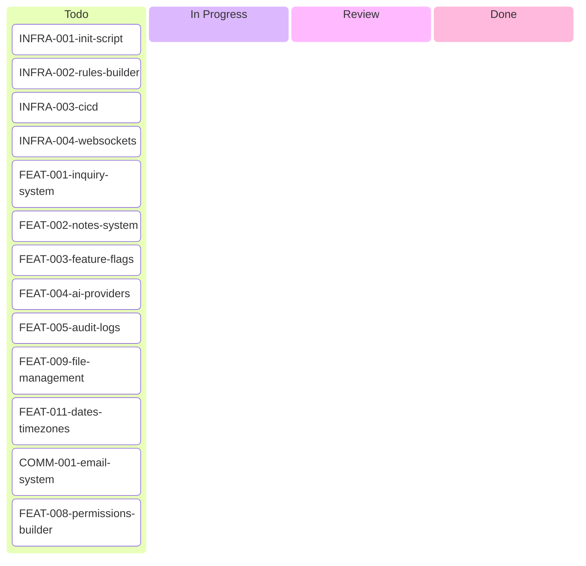

# Aron's Kanban Board



## Tickets

### 🆕 Todo - High Priority

**Infrastructure:**
- [INFRA-001: Init Script](./INFRA-001-init-script.md) ⭐ - One-command setup wizard (accounts, DNS, Doppler)
- [INFRA-002: Rules Builder](./INFRA-002-rules-builder.md) ⭐ - Visual rules builder (separate repo)
- [INFRA-003: CI/CD](./INFRA-003-cicd.md) - Review branch deployment strategy
- [INFRA-004: WebSockets](./INFRA-004-websockets.md) - Real-time features completion

**Features:**
- [FEAT-001: Inquiry System](./FEAT-001-inquiry-system.md) - Space CRUD, user invites, onboarding
- [FEAT-002: Notes System](./FEAT-002-notes-system.md) - Polymorphic notes (from Carde)
- [FEAT-003: Feature Flags](./FEAT-003-feature-flags.md) ⭐ - DB + Redis + WS + Admin UI
- [FEAT-004: AI Providers](./FEAT-004-ai-providers.md) - OpenAI, Anthropic, Gemini (from Zealot)
- [FEAT-005: Audit Logs](./FEAT-005-audit-logs.md) ⭐ - Mutation tracking for compliance
- [FEAT-009: File Management](./FEAT-009-file-management.md) - S3 uploads, CDN, virus scanning
- [FEAT-011: Dates & Timezones](./FEAT-011-dates-timezones.md) - Timezone handling, recurring events

**Communications:**
- [COMM-001: Email System](./COMM-001-email-system.md) - Complete email (blocked by rules builder)
- [FEAT-008: Permissions Builder](./FEAT-008-permissions-builder.md) - Visual permission editor (blocked by rules builder)

### 📦 Backlog

See [Backlog Board](./kanban-backlog.md) for future enhancements (localization, white labeling, SSO, notifications, financial systems, etc.)

### 🚧 In Progress
_No tickets currently in progress_

### 👀 Review
_No tickets currently in review_

### ✅ Done
_No completed tickets yet_

---

## Quick Stats

- **Total Tickets**: 13
- **Todo**: 13
- **In Progress**: 0
- **Blocked**: 2 (waiting on rules builder)
- **Completed This Week**: 0
- **Moved to Backlog**: 7 (see [Backlog Board](./kanban-backlog.md))

## Dependency Map

```
INFRA-002 (Rules Builder)
├─> COMM-001 (Email System)
└─> FEAT-008 (Permissions Builder)

INFRA-001 (Init Script)
└─> INFRA-003 (CI/CD)
    └─> FEAT-007 (White Labeling - DNS)

INFRA-004 (WebSockets)
└─> FEAT-003 (Feature Flags - real-time updates)
```

---

_Last Updated: 2026-02-06_
