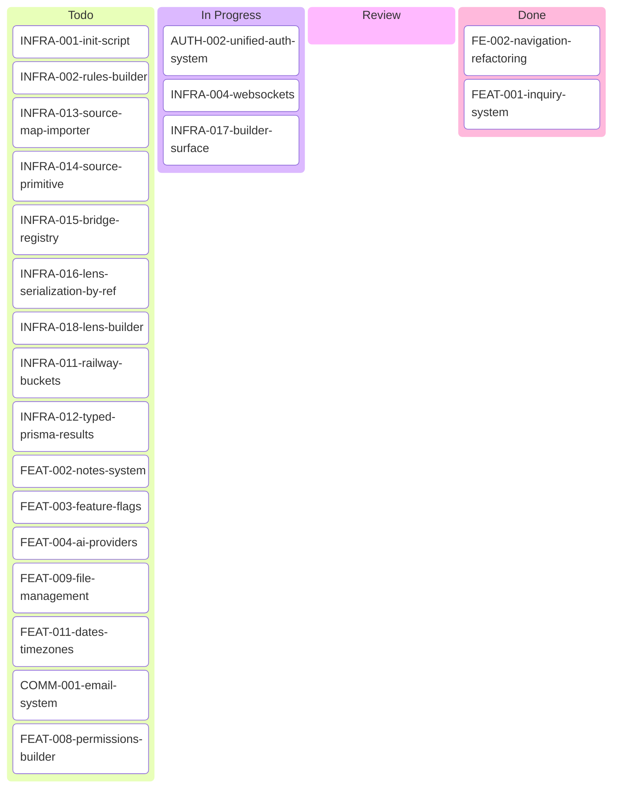

# Aron's Kanban Board


```mermaid
---
config:
  kanban:
    ticketBaseUrl: 'https://github.com/yourorg/template/blob/main/tickets/#TICKET#'
---
kanban
  Todo
    INFRA-001-init-script
    INFRA-002-rules-builder
    INFRA-013-source-map-importer
    INFRA-014-source-primitive
    INFRA-015-bridge-registry
    INFRA-016-lens-serialization-by-ref
    INFRA-018-lens-builder
    INFRA-011-railway-buckets
    INFRA-012-typed-prisma-results
    FEAT-002-notes-system
    FEAT-003-feature-flags
    FEAT-004-ai-providers
    FEAT-009-file-management
    FEAT-011-dates-timezones
    COMM-001-email-system
    FEAT-008-permissions-builder
  In Progress
    AUTH-002-unified-auth-system
    INFRA-004-websockets
    INFRA-017-builder-surface
  Review
  Done
    FE-002-navigation-refactoring
    FEAT-001-inquiry-system
```

## Tickets

### 🆕 Todo

**Infrastructure:**
- [INFRA-001: Init Script](./INFRA-001-init-script.md) ⭐ - One-command setup wizard (accounts, DNS, Doppler)
- [INFRA-002: Rules Builder](./INFRA-002-rules-builder.md) ⭐ - Visual rules builder (rules-builder repo)
- [INFRA-011: Railway Buckets](./INFRA-011-railway-buckets.md) - S3 adapter + MinIO local + bucket provisioning (blocks FEAT-009)
- [INFRA-012: Typed Prisma Results](./INFRA-012-typed-prisma-results-with-zod-json-registry.md) - Branded IDs + zod JSON typing via Prisma `$extends`

**Rules / Lens Platform** (json-rules + rules-builder):
- [INFRA-017: Builder Surface](./INFRA-017-builder-surface.md) ⭐ - exposedSurface ✅ + serializable projection + describeRule (🚧 in progress)
- [INFRA-016: Lens Serialization + seal](./INFRA-016-lens-serialization-by-ref.md) - Parallel serializable types (refs not parent objects) + seal (tenant→subtenant)
- [INFRA-015: Bridge Registry](./INFRA-015-bridge-registry.md) - Save & reuse bridges across lenses
- [INFRA-014: Source Primitive](./INFRA-014-source-primitive.md) - Formalize sources (hydrated tables) + custom-field tables
- [INFRA-013: Source-Map Importer](./INFRA-013-source-map-importer.md) - Non-Prisma schema → FieldMap (in rules-builder)
- [INFRA-018: Lens Builder](./INFRA-018-lens-builder.md) - Compose lens + narrowings (in rules-builder)

**Features:**
- [FEAT-002: Notes System](./FEAT-002-notes-system.md) - Polymorphic notes (from Carde)
- [FEAT-003: Feature Flags](./FEAT-003-feature-flags.md) ⭐ - DB + Redis + WS + Admin UI
- [FEAT-004: AI Providers](./FEAT-004-ai-providers.md) - OpenAI, Anthropic, Gemini (from Zealot)
- [FEAT-009: File Management](./FEAT-009-file-management.md) - S3 uploads, CDN, virus scanning
- [FEAT-011: Dates & Timezones](./FEAT-011-dates-timezones.md) - Timezone handling, recurring events

**Communications:**
- [COMM-001: Email System](./COMM-001-email-system.md) - Complete email (blocked by rules builder)
- [FEAT-008: Permissions Builder](./FEAT-008-permissions-builder.md) - Visual permission editor (blocked by rules builder)

### 📦 Backlog

See [Backlog Board](./kanban-backlog.md) for future enhancements (localization, white labeling, SSO, notifications, financial systems, CI/CD, etc.)

### 🚧 In Progress
- [AUTH-002: Unified Auth System](./AUTH-002-unified-auth-system.md) - Multi-method auth (email/password, OAuth, SSO/SAML)
- [INFRA-004: WebSockets](./INFRA-004-websockets.md) - Infrastructure complete, wiring up event handlers

### 👀 Review
_No tickets currently in review_

### ✅ Done
- [FEAT-001: Inquiry System](./archived/FEAT-001-inquiry-system.md) - Generic workflow engine for multi-party approval flows
- [FE-002: Navigation Refactoring](./archived/FE-002-navigation-refactoring.md) - Context preservation and navigation cleanup

---

## Quick Stats

- **Total Tickets**: 14
- **Todo**: 11
- **In Progress**: 2
- **Blocked**: 2 (waiting on rules builder)
- **Done**: 2

## Dependency Map

```
INFRA-002 (Rules Builder)
├─> COMM-001 (Email System)
└─> FEAT-008 (Permissions Builder)

INFRA-001 (Init Script)
├─> INFRA-003 (CI/CD)
│   └─> FEAT-007 (White Labeling - DNS)
└─> INFRA-011 (Railway Buckets — Phase 2 provisioning)
    └─> FEAT-009 (File Management)

INFRA-004 (WebSockets)
└─> FEAT-003 (Feature Flags - real-time updates)
```

---

_Last Updated: 2026-05-26_
