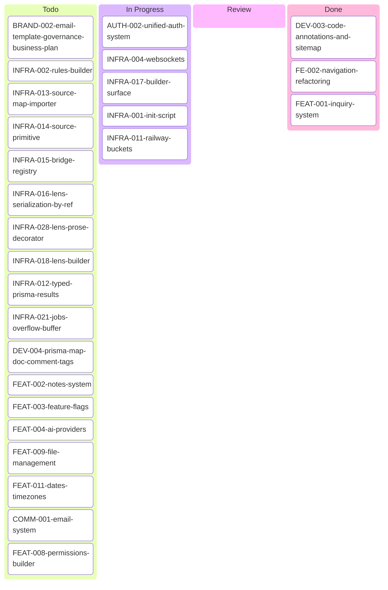

# Aron's Kanban Board


```mermaid
---
config:
  kanban:
    ticketBaseUrl: 'https://github.com/yourorg/template/blob/main/tickets/#TICKET#'
---
kanban
  Todo
    BRAND-002-email-template-governance-business-plan
    INFRA-002-rules-builder
    INFRA-013-source-map-importer
    INFRA-014-source-primitive
    INFRA-015-bridge-registry
    INFRA-016-lens-serialization-by-ref
    INFRA-028-lens-prose-decorator
    INFRA-018-lens-builder
    INFRA-012-typed-prisma-results
    INFRA-021-jobs-overflow-buffer
    DEV-004-prisma-map-doc-comment-tags
    FEAT-002-notes-system
    FEAT-003-feature-flags
    FEAT-004-ai-providers
    FEAT-009-file-management
    FEAT-011-dates-timezones
    COMM-001-email-system
    FEAT-008-permissions-builder
  In Progress
    AUTH-002-unified-auth-system
    INFRA-004-websockets
    INFRA-017-builder-surface
    INFRA-001-init-script
    INFRA-011-railway-buckets
  Review
  Done
    DEV-003-code-annotations-and-sitemap
    FE-002-navigation-refactoring
    FEAT-001-inquiry-system
```

## Tickets

### 🆕 Todo

**Product:**
- [BRAND-002: Email Template Governance — Business Plan](./BRAND-002-email-template-governance-business-plan.md) ⭐ - Stopgap SaaS launch plan (lens-gated template builder + API); sequences INFRA-002, INFRA-011, FEAT-009, COMM-001 + net-new billing/themes/builder

**Infrastructure:**
- [INFRA-002: Rules Builder](./INFRA-002-rules-builder.md) ⭐ - Visual rules builder (rules-builder repo)
- [INFRA-012: Typed Prisma Results](./INFRA-012-typed-prisma-results-with-zod-json-registry.md) - Branded IDs + zod JSON typing via Prisma `$extends`
- [INFRA-021: Jobs Overflow Buffer](./INFRA-021-jobs-overflow-buffer.md) ⭐ - Durable outbox in front of BullMQ at the `enqueueJob` chokepoint; bounds Redis depth on fan-outs (createLock singleton refactor landed)

**Rules / Lens Platform** (json-rules + rules-builder):
- [INFRA-017: Builder Surface](./INFRA-017-builder-surface.md) ⭐ - exposedSurface ✅ + serializable projection + describeRule (🚧 in progress)
- [INFRA-016: Lens Serialization by Reference](./INFRA-016-lens-serialization-by-ref.md) - Parallel serializable types (refs not parent objects); liveness for persisted base lenses (seal dropped — server is sole executor)
- [INFRA-023: Serializable Dynamic `where` (context bindings)](./INFRA-023-serializable-dynamic-where-context-bind.md) 🟢 - `{ bind }` value + `resolveLensBindings` (preprocess into lens) + unique-name/`parent:` discipline; core built in json-rules PR #4 (FEAT-004), additive → 2.11
- [INFRA-015: Bridge Registry](./INFRA-015-bridge-registry.md) - Save & reuse bridges across lenses
- [INFRA-014: Source Primitive](./INFRA-014-source-primitive.md) - Formalize sources (hydrated tables) + custom-field tables
- [INFRA-028: Lens Prose Decorator](./INFRA-028-lens-prose-decorator.md) - Static presentation metadata (labels, icons) on the lens for FE + AI; sibling of INFRA-024's dynamic value axis. Placeholder, shape TBD (ZLT-3633)
- [INFRA-013: Source-Map Importer](./INFRA-013-source-map-importer.md) - Non-Prisma schema → FieldMap (in rules-builder)
- [INFRA-018: Lens Builder](./INFRA-018-lens-builder.md) - Compose lens + narrowings (in rules-builder)
- [INFRA-019: json-rules target sharp edges](./INFRA-019-json-rules-target-sharp-edges.md) - Backlog of check-only operators / target asymmetry

**Developer Tooling:**
- [DEV-004: prisma-map doc-comment tags](./DEV-004-prisma-map-doc-comment-tags.md) - `///` tag for self-relation parent direction → factory traversal + hydration tree auto-fill (feature lives in `@inixiative/prisma-map`)

**Features:**
- [FEAT-002: Notes System](./FEAT-002-notes-system.md) - Polymorphic notes (from Carde)
- [FEAT-003: Feature Flags](./FEAT-003-feature-flags.md) ⭐ - DB + Redis + WS + Admin UI
- [FEAT-004: AI Providers](./FEAT-004-ai-providers.md) - OpenAI, Anthropic, Gemini (from Zealot)
- [FEAT-009: File Management](./FEAT-009-file-management.md) - S3 uploads, CDN, virus scanning
- [FEAT-011: Dates & Timezones](./FEAT-011-dates-timezones.md) - Timezone handling, recurring events

**Communications:**
- [COMM-001: Email System](./COMM-001-email-system.md) - Complete email (blocked by rules builder)
- [FEAT-008: Permissions Builder](./FEAT-008-permissions-builder.md) - Visual permission editor (blocked by rules builder)

### 📦 Backlog

See [Backlog Board](./kanban-backlog.md) for future enhancements (localization, white labeling, SSO, notifications, financial systems, CI/CD, etc.)

### 🚧 In Progress
- [AUTH-002: Unified Auth System](./AUTH-002-unified-auth-system.md) - Multi-method auth (email/password, OAuth, SSO/SAML)
- [INFRA-004: WebSockets](./INFRA-004-websockets.md) - Infrastructure complete, wiring up event handlers
- [INFRA-017: Builder Surface](./INFRA-017-builder-surface.md) - exposedSurface ✅ + describeRule ✅; serializable projection deferred
- [INFRA-001: Init Script](./INFRA-001-init-script.md) - Setup wizard (`init/` + scripts built)
- [INFRA-011: Railway Buckets](./INFRA-011-railway-buckets.md) - MinIO local + s3 adapter + bucket provisioning built

### 👀 Review
_No tickets currently in review_

### ✅ Done
- [DEV-003: Code Annotations & Sitemap](./archived/DEV-003-code-annotations-and-sitemap.md) - atlas code-map (`@atlas` + `MAP.md`) shipped (#50)
- [FEAT-001: Inquiry System](./archived/FEAT-001-inquiry-system.md) - Generic workflow engine for multi-party approval flows
- [FE-002: Navigation Refactoring](./archived/FE-002-navigation-refactoring.md) - Context preservation and navigation cleanup

---

## Quick Stats

- **Total Tickets**: 17
- **Todo**: 12
- **In Progress**: 5
- **Blocked**: 2 (waiting on rules builder)
- **Done**: 3

## Dependency Map

```
INFRA-002 (Rules Builder)
├─> COMM-001 (Email System)
└─> FEAT-008 (Permissions Builder)

INFRA-001 (Init Script)
├─> INFRA-003 (CI/CD)
│   └─> FEAT-007 (White Labeling - DNS)
└─> INFRA-011 (Railway Buckets — Phase 2 provisioning)
    └─> FEAT-009 (File Management)

INFRA-004 (WebSockets)
└─> FEAT-003 (Feature Flags - real-time updates)
```

---

_Last Updated: 2026-06-18_
