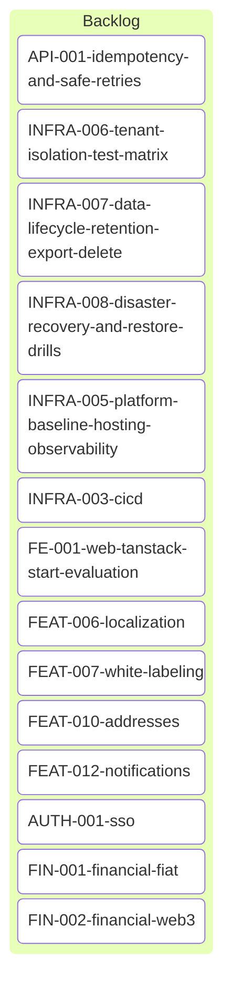

# Backlog Board (Unassigned)

## Tickets

### 📦 Backlog - Future Enhancements

**User Experience:**
- [FEAT-006: Localization](./FEAT-006-localization.md) - i18n support, multi-language
- [FEAT-007: White Labeling](./FEAT-007-white-labeling.md) - Custom domains, DNS hooks, CORS, theming
- [FEAT-010: Addresses](./FEAT-010-addresses.md) - Address validation, geocoding, international formats
- [FEAT-012: Notifications](./FEAT-012-notifications.md) - Novu integration, app-events completion, notification center

**Enterprise:**
- [AUTH-001: SSO](./AUTH-001-sso.md) - SAML/OIDC, JIT provisioning, SCIM

**Financial:**
- [FIN-001: Financial - Fiat](./FIN-001-financial-fiat.md) - Stripe alternatives (Paddle, Lemon Squeezy, Adyen)
- [FIN-002: Financial - Web3](./FIN-002-financial-web3.md) - Crypto payments, NFT gating, wallet connect

**Infrastructure / Platform:**
- [INFRA-005: Platform Baseline](./INFRA-005-platform-baseline-hosting-observability.md) - Pick default hosting + DB + observability stack
- [INFRA-003: CI/CD Pipeline](./INFRA-003-cicd.md) - Decision-first CI/CD baseline, implement after platform selection
- [INFRA-006: Tenant Isolation Test Matrix](./INFRA-006-tenant-isolation-test-matrix.md) - Prove cross-tenant isolation across auth modes
- [INFRA-007: Data Lifecycle](./INFRA-007-data-lifecycle-retention-export-delete.md) - Retention, export, and delete/redaction operations
- [INFRA-008: Disaster Recovery](./INFRA-008-disaster-recovery-and-restore-drills.md) - Backup/restore strategy and restore drills

**API Reliability:**
- [API-001: Idempotency and Safe Retries](./API-001-idempotency-and-safe-retries.md) - Prevent duplicate side effects on retried writes

**Frontend Architecture:**
- [FE-001: TanStack Start Migration (SEO)](./FE-001-web-tanstack-start-evaluation.md) - Migrate `apps/web` to Start with clean runtime boundaries

---

## Categorization

### Polish & Scaling
- Localization (global expansion)
- White labeling (reseller/enterprise)
- Addresses (e-commerce, compliance)

### Communication & Engagement
- Notifications (user engagement, retention)

### Enterprise Features
- SSO (enterprise sales requirement)

### Monetization (Deferred Decision)
- Fiat payments (traditional SaaS)
- Web3 payments (crypto-native SaaS)

---

## Quick Stats

- **Total Backlog Items**: 14
- **Polish**: 3
- **Enterprise**: 1
- **Financial**: 2
- **Communication**: 1
- **Infrastructure**: 5
- **Frontend Architecture**: 1
- **API Reliability**: 1

## Notes

**Why Backlog?**
These features are valuable but not critical for MVP or initial production launch. They're typical "v2.0" enhancements that add polish, enterprise appeal, or alternative monetization strategies.

**Prioritization Triggers:**
- **Localization**: When targeting non-English markets
- **White Labeling**: When enterprise/reseller demand exists
- **SSO**: When closing enterprise deals
- **Notifications**: When user engagement metrics drop
- **Financial systems**: When monetization strategy is decided

---

_Last Updated: 2026-02-07_
