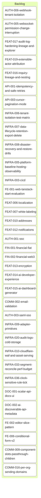

# Backlog Board (Unassigned)

```mermaid
---
config:
  kanban:
    ticketBaseUrl: 'https://github.com/yourorg/template/blob/main/tickets/#TICKET#'
---
kanban
  Backlog
    AUTH-006-webhook-tenant-isolation
    AUTH-005-websocket-permission-change-interruption
    FEAT-017-audit-log-hardening-lineage-and-explorer
    FEAT-019-extensible-actor-attribution
    FEAT-016-inquiry-lineage-and-nesting
    API-001-idempotency-and-safe-retries
    API-003-cursor-pagination-mode
    INFRA-006-tenant-isolation-test-matrix
    INFRA-007-data-lifecycle-retention-export-delete
    INFRA-008-disaster-recovery-and-restore-drills
    INFRA-005-platform-baseline-hosting-observability
    INFRA-003-cicd
    FE-001-web-tanstack-start-evaluation
    FEAT-006-localization
    FEAT-007-white-labeling
    FEAT-010-addresses
    FEAT-012-notifications
    AUTH-001-sso
    FIN-001-financial-fiat
    FIN-002-financial-web3
    FEAT-013-encryption
    FEAT-014-ai-developer-experience
    FEAT-015-ai-dashboard-generator
    COMM-002-email-validation
    AUTH-003-saml-sso
    INFRA-009-adapter-primitives
    INFRA-020-audit-logs-cold-storage
    INFRA-010-cloudflare-waf-and-asset-serving
    INFRA-033-segment-reconcile-perf-budget
    INFRA-036-clock-sensitive-rule-tick
    DOC-001-scalar-api-docs-ui
    DOC-002-ai-discoverable-api-metadata
    FE-002-editor-slice-pattern
    FE-006-conditional-form-v2
    COMM-009-component-slots-passthrough-children
    COMM-016-per-org-sending-domains
```

## Tickets

### 📦 Backlog - Future Enhancements

**User Experience:**
- [FEAT-006: Localization](./FEAT-006-localization.md) - i18n support, multi-language
- [FEAT-007: White Labeling](./FEAT-007-white-labeling.md) - Custom domains, DNS hooks, CORS, theming
- [FEAT-010: Addresses](./FEAT-010-addresses.md) - `ContactType.address` with libaddressinput metadata, Google adapter (INFRA-009) porting Zealot`s geocode fallbacks, `Contact.country`/`region` for rules, snapshots at use
- [FEAT-012: Notifications](./FEAT-012-notifications.md) - Novu integration, app-events completion, notification center
- [COMM-002: Email Validation](./COMM-002-email-validation.md) - Email verification API (Bouncer/Emailable) for deliverability

**Communications:**
- [COMM-009: Component Slots](./COMM-009-component-slots-passthrough-children.md) - `{{slot:name}}` passthrough children for wrapper components (not registered/cascading subcomponents); from ZLT-3139
- [COMM-016: Per-org Sending Domains](./COMM-016-per-org-sending-domains.md) - Stub. Each org signs with its own verified domain; port of Zealot's "Per-brand email domains" once its shape settles

**Enterprise:**
- [AUTH-001: SSO](./AUTH-001-sso.md) - SAML/OIDC, JIT provisioning, SCIM
- [AUTH-003: SAML SSO](./AUTH-003-saml-sso.md) - SAML 2.0 via BetterAuth SSO plugin (depends on AUTH-002)

**Financial:**
- [FIN-001: Financial - Fiat](./FIN-001-financial-fiat.md) - Stripe alternatives (Paddle, Lemon Squeezy, Adyen)
- [FIN-002: Financial - Web3](./FIN-002-financial-web3.md) - Crypto payments, NFT gating, wallet connect

**Infrastructure / Platform:**
- [INFRA-005: Platform Baseline](./INFRA-005-platform-baseline-hosting-observability.md) - Pick default hosting + DB + observability stack
- [INFRA-003: CI/CD Pipeline](./INFRA-003-cicd.md) - Decision-first CI/CD baseline, implement after platform selection
- [INFRA-006: Tenant Isolation Test Matrix](./INFRA-006-tenant-isolation-test-matrix.md) - Prove cross-tenant isolation across auth modes
- [INFRA-007: Data Lifecycle](./INFRA-007-data-lifecycle-retention-export-delete.md) - Retention, export, and delete/redaction operations
- [INFRA-008: Disaster Recovery](./INFRA-008-disaster-recovery-and-restore-drills.md) - Backup/restore strategy and restore drills
- [INFRA-009: Adapter Primitives](./INFRA-009-adapter-primitives.md) - Swappable external service pattern (in progress)
- [INFRA-020: Audit Log Cold Storage](./INFRA-020-audit-logs-cold-storage.md) - Ship audit logs to cold storage before hot-deletion
- [INFRA-031: Jobs lane + lock port from Zealot](./archived/INFRA-031-jobs-lane-and-lock-port-from-zealot.md) ✅ - slow lane as lowest priority + per-worker slot share, createLock refresh fix, row-state claim policy
- [INFRA-010: Cloudflare WAF & Asset Serving](./INFRA-010-cloudflare-waf-and-asset-serving.md) - WAF rules, DDoS protection, CDN, init script integration
- [INFRA-033: Segment Reconcile Perf Budget](./INFRA-033-segment-reconcile-perf-budget.md) - Measure DB load of both reconcile rails; set the scale threshold for field-level trigger narrowing
- [INFRA-036: Clock-Sensitive Rule Tick](./INFRA-036-clock-sensitive-rule-tick.md) - `Segment.clockUnit` (hour/day/week/month) derived at save by a json-rules fold; one sweep cron row per unit

**Audit & Compliance:**
- [FEAT-017: Audit Log Hardening, Inquiry Lineage, and Explorer](./FEAT-017-audit-log-hardening-lineage-and-explorer.md) - Durable audit writes, inquiry causality, and admin audit browsing
- [FEAT-019: Extensible Actor Attribution](./FEAT-019-extensible-actor-attribution.md) - actorMeta extension point + on-behalf-of for integration tokens; attribution-only, never authz

**Security & Encryption:**
- [AUTH-006: Webhook Tenant Isolation](./AUTH-006-webhook-tenant-isolation.md) - High-priority confirmed defect: scope recipients and payloads to the subscription owner's authorized records
- [AUTH-005: WebSocket Permission Changes](./AUTH-005-websocket-permission-change-interruption.md) - Event-driven subscription interruption; deferred scaffolding follow-up, tracked in GitHub #126
- [FEAT-013: Encryption](./FEAT-013-encryption.md) - Key escrow/backup, lifecycle management, feature visibility

**AI Developer Experience:**
- [FEAT-014: AI Developer Experience](./FEAT-014-ai-developer-experience.md) - Skills, rules, agents, MCP servers for AI-native development
- [FEAT-015: AI Dashboard Generator](./FEAT-015-ai-dashboard-generator.md) - Natural language → dashboard from component catalog via json-render

**Inquiry System Extensions:**
- [FEAT-016: Inquiry Lineage & Nesting](./FEAT-016-inquiry-lineage-and-nesting.md) - parentInquiryId, metadata JSON, migration-spawned inquiries, child inquiry resolution

**API Reliability:**
- [API-001: Idempotency and Safe Retries](./API-001-idempotency-and-safe-retries.md) - Prevent duplicate side effects on retried writes
- API-002: Admin Ad-Hoc Filtering - Make admin list routes exempt from requiring `searchableFields`; allow arbitrary field filtering for internal/superadmin use
- [API-003: Cursor Pagination Mode](./API-003-cursor-pagination-mode.md) - Opt-in keyset pagination (signed opaque tokens, no count, write-stable) for feeds/logs/exports; offset stays default

**Documentation & API Discovery:**
- [DOC-001: Scalar API Docs UI](./DOC-001-scalar-api-docs-ui.md) - Interactive API docs via Scalar, mounted on existing OpenAPI spec
- [DOC-002: AI-Discoverable API Metadata](./DOC-002-ai-discoverable-api-metadata.md) - Page metadata, `.well-known` endpoint, and visible links for AI agent discovery

**Frontend Architecture:**
- [FE-001: TanStack Start Migration (SEO)](./FE-001-web-tanstack-start-evaluation.md) - Migrate `apps/web` to Start with clean runtime boundaries
- [FE-002: Editor Slice Pattern](./FE-002-editor-slice-pattern.md) - `makeEditorSlice` factory for standardized form/model editing state
- [FE-006: Conditional Form v2](./FE-006-conditional-form-v2.md) - Rewrite of inixiative/conditional-form on json-rules + rules-builder; the home for generic FE in-memory filtering

---

## Categorization

### Polish & Scaling
- Localization (global expansion)
- White labeling (reseller/enterprise)
- Addresses (e-commerce, compliance)

### Communication & Engagement
- Notifications (user engagement, retention)
- Email Validation (deliverability, sender reputation)

### Enterprise Features
- SSO (enterprise sales requirement)

### Monetization (Deferred Decision)
- Fiat payments (traditional SaaS)
- Web3 payments (crypto-native SaaS)

---

## Quick Stats

- **Total Backlog Items**: 34
- **Polish**: 3
- **Enterprise**: 2
- **Financial**: 2
- **Communication**: 3
- **Infrastructure**: 9
- **Audit & Compliance**: 1
- **Security & Encryption**: 3
- **AI Developer Experience**: 2
- **Frontend Architecture**: 3
- **Documentation & Discovery**: 2
- **API Reliability**: 2

## Notes

**Why Backlog?**
AUTH-006 is a confirmed isolation defect awaiting assignment and has High priority. It is distinct from the optional enhancements below.

These features are valuable but not critical for MVP or initial production launch. They're typical "v2.0" enhancements that add polish, enterprise appeal, or alternative monetization strategies.

**Prioritization Triggers:**
- **Localization**: When targeting non-English markets
- **White Labeling**: When enterprise/reseller demand exists
- **SSO**: When closing enterprise deals
- **Notifications**: When user engagement metrics drop
- **Financial systems**: When monetization strategy is decided

---

_Last Updated: 2026-10-05_
