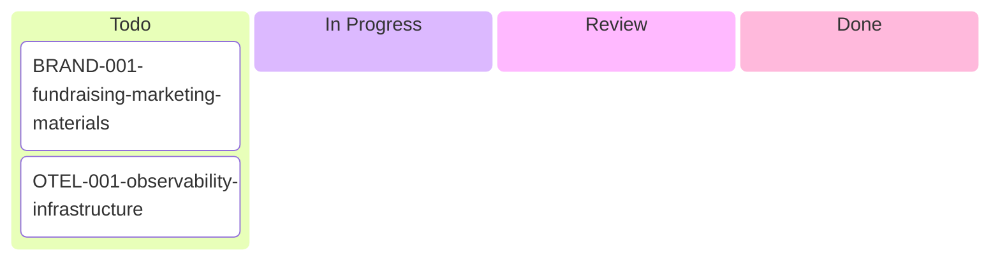

# Hernan's Kanban Board

## Tickets

### 🆕 Todo
- [BRAND-001: Fundraising & Marketing Materials](./BRAND-001-fundraising-marketing-materials.md) ⭐ - Pitch deck, social media, brand identity, technical marketing
- [OTEL-001: Observability Infrastructure](./OTEL-001-observability-infrastructure.md) - Implement OTEL instrumentation, OpenPanel, and superadmin observability dashboard

### 🚧 In Progress
_No tickets currently in progress_

### 👀 Review
_No tickets currently in review_

### ✅ Done
_No completed tickets yet_

---

## Quick Stats

- **Total Tickets**: 2
- **In Progress**: 0
- **Blocked**: 0
- **Completed This Week**: 0

---

_Last Updated: 2026-02-06_
