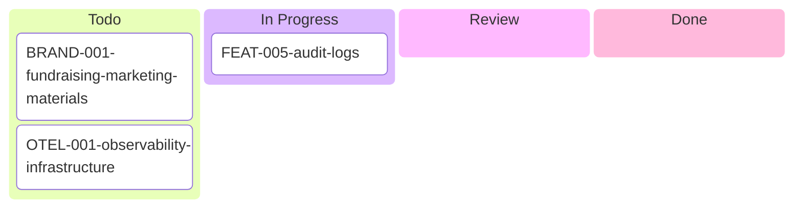

# Hernan's Kanban Board

```mermaid
---
config:
  kanban:
    ticketBaseUrl: 'https://github.com/yourorg/template/blob/main/tickets/#TICKET#'
---
kanban
  Todo
    BRAND-001-fundraising-marketing-materials
    OTEL-001-observability-infrastructure
  In Progress
    FEAT-005-audit-logs
  Review
  Done
```

## Tickets

### 🆕 Todo
- [BRAND-001: Fundraising & Marketing Materials](./BRAND-001-fundraising-marketing-materials.md) - Pitch deck, social media, brand identity, technical marketing
- [OTEL-001: Observability Infrastructure](./OTEL-001-observability-infrastructure.md) - Implement OTEL instrumentation, OpenPanel, and superadmin observability dashboard

### 🚧 In Progress
- [FEAT-005: Audit Logs](./FEAT-005-audit-logs.md) ⭐ - Comprehensive audit logging with spoof tracking, shared utilities, DataTable UI

### 👀 Review
_No tickets currently in review_

### ✅ Done
_No completed tickets yet_

---

## Quick Stats

- **Total Tickets**: 3
- **Todo**: 2
- **In Progress**: 1
- **Blocked**: 0

---

_Last Updated: 2026-03-31_
